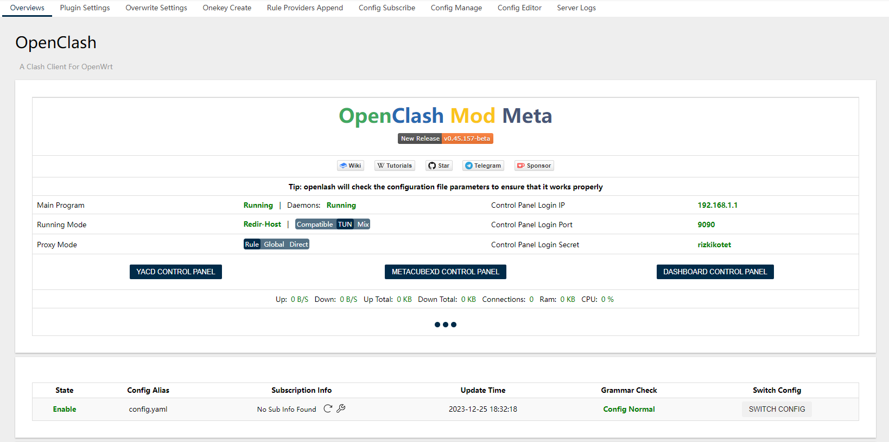
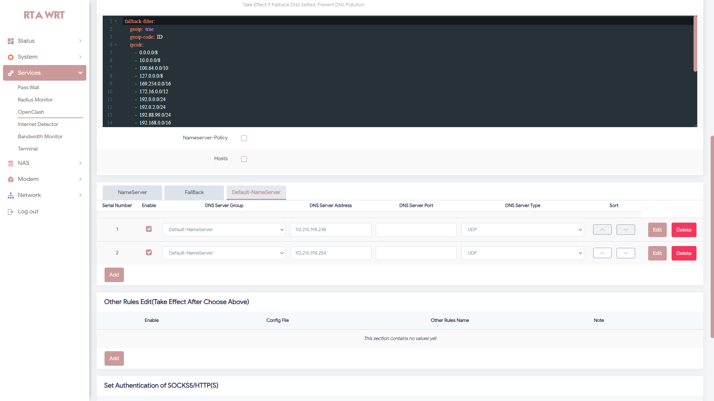
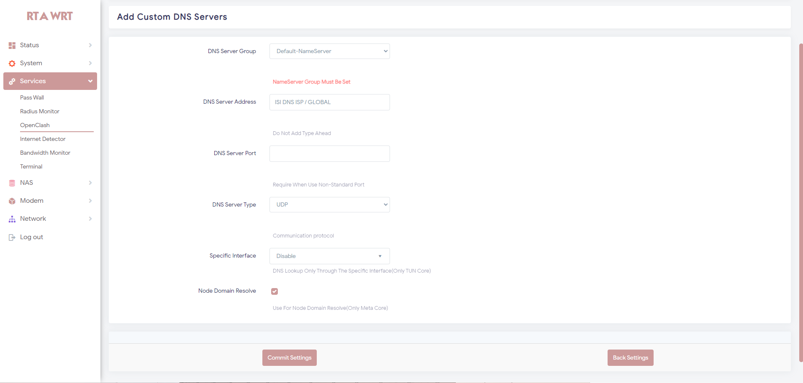
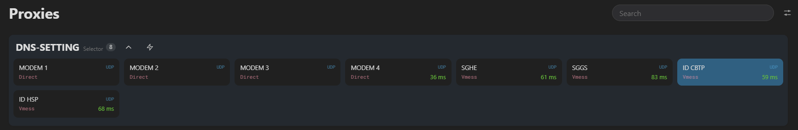
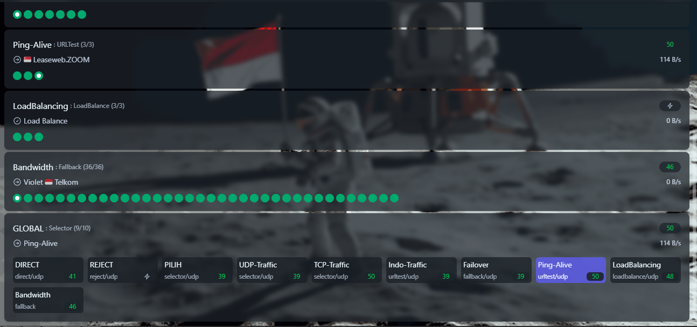

<h1 align="center">
  
  <br>Config OpenClash - Meta Kernel<br>
</h1>

<p align="center">
  <a href="https://github.com/antifragile0/Config-Open-ClashMeta/releases">
    
  </a>
  <a href="https://github.com/antifragile0/Config-Open-ClashMeta/blob/main/LICENSE">
   
  </a>
</p>

## Features

Simpel Config Pisah Traffic OpenClash Meta Version

- Fast Connect
- Anti Leaked
- Pisah Trafik Gaming Online
- Pisah Trafik Indo Only
- Adblock
- Support +2 Modem

<p>

<p align="center">
  <a href="https://github.com/antifragile0/Config-Open-ClashMeta/releases">
    <button type="button" name="myButton">Download Config</button>
  </a>
</p>

## Documentation

- For Nikki (Mihomo) :

```bash
bash -c "$(curl -fsSL 'https://github.com/antifragile0/OpenWrt-nikki-Mod/raw/refs/heads/main/install.sh')"
```

### Overviews



### Setting Configuration DNS

- NOTES : `DNS Provider Khusus Nol Kuota`
  - `112.215.198.248` : DNS XL
  - `112.215.198.254` : DNS XL
- Silahkan Ganti Dengan DNS Provider / DNS Global
- Contoh :
  - `1.1.1.1` : Cloudflare
  - `8.8.8.8` : Google
  - `9.9.9.9` : Quad9



- Jika Ingin Menambahkan DNS Baru



### Yacd Overviews Configuration

- Setting DNS Di Yacd
  - `Jika Dari ISP / MODEM` `DNS Leaked`. Tapi Fast Connect
  - `Jika Dari SERVER` `DNS Anti Leaked`. Tapi Butuh Beberapa Detik Baru Internet Jalan
- `NOTES` : Leaked Di Atas Tergantung Saat Pengisian DNS Di `Default-NameServer`
  - Silahkan Cek Di Atas Fungsinya



- Setting Global Proxy
  - `Traffic-Browsing`



---
Notepad++ v8.7.5 regression-fixes, bug-fixes & enhancements:

 1. Fix nfo file losing modification issue (regression from v8.7.4).
 2. Fix network file wrong modification detection (regression from v8.7.1).
 3. Fix regression "Open Selected PathName(s)" command not working while all selected.
 4. Fix unusuability after deleting files in split view.
 5. Fix unsaved documents lost on next launch if portable Notepad++ change path.    
 6. Refactoring for the better performance & smaller binary size.
 7. Improve "Copy Selected Lines" command.
 8. Add Visual Basic function list.
 9. Add Swift, TypeScript, and Go for advanced Auto-indent.
10. Fix UDL comment line not working due to conflict with stream comment definition.
11. Enhance "Follow current doc." GUI action/option in Find in files.
12. Fix Reload Workspace not working.
13. Add "Show details" functionality in installer.


Notepad++ v8.7.4 regression-fix & bug-fixes:

1. Fix regression of multi-line tabbar height not updated after closing tabs.
2. Fix the extension defined by user not override language default extensions.
3. Fix encoding of nfo file cannot be changed bug.


Notepad++ v8.7.3 bug-fixes & new features :

1. Fix a crash while disabling "Pin tab" feature.
2. Fix drag&drop a folder in Notepad++ launch redundant dialog regression.
3. Fix docked panels invisibility in multi-instance mode.
4. Add "Pin/Unpin Tab" context menu item.
5. Add "Close All BUT Pinned" command.
6. Fix a possible buffer overflow issue.


Notepad++ v8.7.2 new features & bug-fixes:

1. Add Pin tab feature.
2. Tabbar enhancement: Hide inactive tab Close & Pin buttons.  
3. Tabbar enhancement: Highlight inactive darken tab on mouse hover.
4. Fix Ctrl-C not doing copy from Search result issue.
5. Add "Minimize / Close to" option for System tray.
6. Add ability to open/copy selected files from Search-results.
7. Fix replace field focus losing when Notepad++ is switched back.


Get more info on
https://notepad-plus-plus.org/downloads/v8.7.5/


Included plugins:

1.  NppExport v0.4
2.  Converter v4.6
3.  Mime Tool v3.1


Updater (Installer only):

* WinGUp (for Notepad++) v5.3.1
